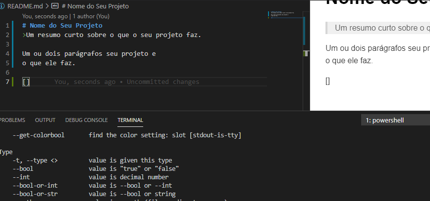

# Nome do Seu Projeto
>Um resumo curto sobre o que o seu projeto faz.

Um ou dois parágrafos seu projeto e 
o que ele faz.



## Instalação

MAC OS X & Linux

```sh
npm install --save

```
Windows

```sh
edit autoexec.bat
```

## Exemplo de uso

Alguns exemplos que motivariam as pessoas a utilizarem seu projeto ou que demonstrasse que este é útil para alguma coisa. Divida esta parte em partes menores e, se possível, coloque algum código ou prints de telas.


## Ambiente de Desenvolvimento

Descrever como instalar e preparar qualquer dependência de desenvolvimento para que seu projeto possa ser executado localmente e pessoas possam contribuir com ele. Se possível, forneça informações para diiferentes plataformas. Exemplos: Windows, Linux e MAC OS.

# Histórico de Atualizações

* 0.2.1
    * CHANGE: atualização dos docs (o código não foi alterador)
* 0.2.0
    * CHANGE: removida a função `setpadraoXYZ()`
    * ADD: adicionado a função `inicializar()`
* 0.1.1
    * FIX: crash quando executava `escrever` (Obrigado ao @Contribuidor)
* 0.1.0
    * Primeiro lançamento estável
    * CHANGE: renomeado de `Projeto XYZ` para `Projeto ABC`
* 0.0.1
    * Projeto Inicial

## Meta
Seu Nome - [@SeuTwitter](https://twitter.com/seuTwitter) - seuemail@gmail.com

Distribuido sobre a licença Veja `LICENÇA` para mais informações

[GitHub](https://github.com/seuUsuario/seuProjeto)
